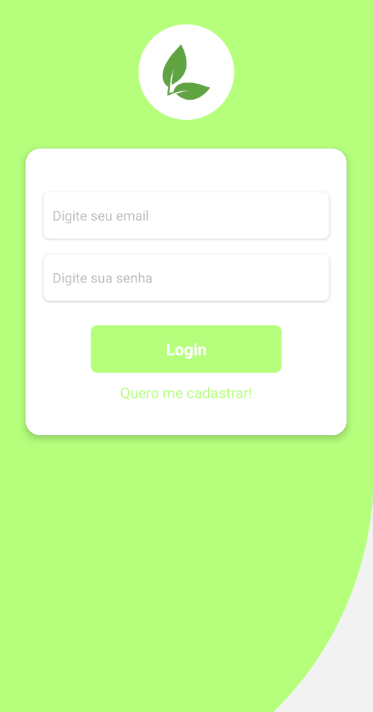

</br>

<p>PROJETO EM REACT-NATIVE</p>
<hr>
</br>
    <p aling="center"> 🌱 O GreenNotion é um projeto que visa auxiliar as tarefas dos nossos usuários no dia a dia! </p>
    <ul>
        <li>Crie suas anotações e organize suas tarefas para que tudo saia como o planejado!</li>
    </ul>
</br>
    
</br>

### 🎲 Rodando o Front 

```bash

    # Clone este repositório  
    $ git clone <https://github.com/KayoSilva19/appDeAnotacoes-React-Native>

    # Acesse a pasta do projeto no terminal/cmd
    $ cd appDeAnotacoes-React-Native

    $ npm install

    # Com o React-Native instalado execute o projeto
    $ npx react-native run-android

```
